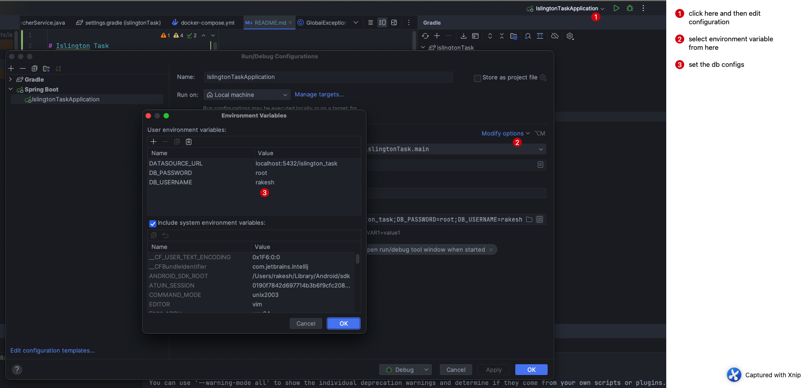
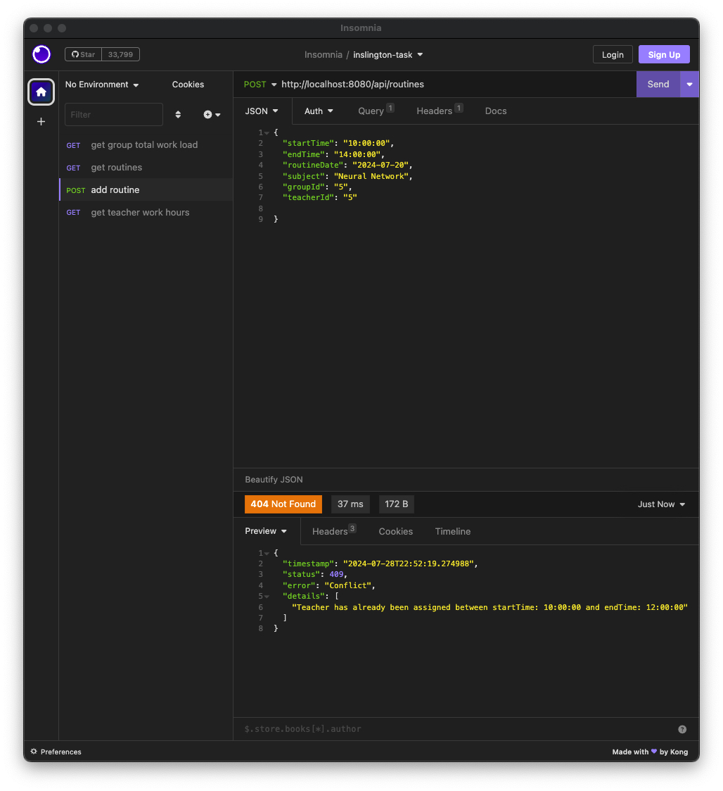

# Islington Task

## Features

- Validation on routine creation for conflict routine (see bottom), and blank data
- use of `@ControllerAdvice` for global validation message
- use of liquibase for database migration and seeding data
- Follows Rest API priciples
- Proper use of database queries and avoidance of multiple queries using Join Fetch & EntityGraphs
- Docker container ready to run app in docker with postgres

## Run Locally

1. Clone the project

```bash
  git clone https://github.com/walkeratmind/islingtonTask.git
```

1. Create new postgresql database named `islington_task` with username and password.
2. Open Project in Intellij.

2. Copy the database configurations to your env variables as:


3. Copy the database configurations to your env variables in intellij run configurations.

   | Environment Variable Name | String |
      | :------------------------ | :------------------------------------- |
   | DATABASE_URL | <database-url-host:port/database-name> |
   | DB_USERNAME | username |
   | DB_PASSWORD | password |

   

4. Now run the spring boot application and the database is updated by liquibase.

### Run in Docker

if you have docker setup, you can run this application using docker as well, there's `docker-compose.yml` that has the
configuration for postgres and this app. You can simply run:

```bash
  docker-compose up --build
```

## API Reference

There's API collection also in in `api-collections` that can be imported in postman/insomnia.

### Routine

#### Add Routine

```http
  POST /api/routines
```

Request Body

```json
{
	"startTime": "10:00:00",
	"endTime": "12:00:00",
	"routineDate": "2024-07-20",
	"subject": "Neural Network",
	"groupId": "5",
	"teacherId": "5"
    
}
```

#### Get all Routine

```http
  GET /api/routines
```

#### Get Routine by Id

```http
  GET /api/routines/${id}
```

| Path Variable | Type     | Description              |
|:--------------|:---------|:-------------------------|
| `id`          | `string` | **Required**. routine id |

### Teacher

#### Get teacher total work hours

```http
  GET /api/teachers/work_hours
```

| Parameter     | Type     | Description                             |
|:--------------|:---------|:----------------------------------------|
| `teacherName` | `string` | teacher's name                          |
| `startDate`   | `string` | start date range in `yyyy-MM-dd` format |
| `endDate`     | `string` | end date  in `yyyy-MM-dd` format        |

### Group

#### Get Group total work load

```http
  GET /api/group/workload
```

| Parameter | Type     | Description            |
|:----------|:---------|:-----------------------|
| `groupId` | `string` | **Required**. group id |

## Notes

There's validation for teacher's time slot when routine is created. For eg: if teacher has already routine
for startTime: 10am to 12 pm , then when creating routine on same date, with startTime: 9:00:00 and endTime: 14:00:00
on same date for same teacher, conflicted error is shown.

